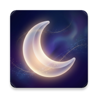

# 🌕 DreamPulse - The Cosmic Sleep Experience for Wear OS

  

  
  
  

---

## 🇸🇦 حل العقدة العالمية: لماذا DreamPulse مختلف؟

هل سألت نفسك يوماً لماذا تستيقظ متعباً رغم أنك ضبطت المنبه لـ 8 ساعات؟  
**المشكلة:** المنبهات التقليدية تبدأ بالعد التنازلي فور ضبطها، متجاهلة الوقت الذي تستغرقه لتغفو (والذي قد يصل لساعة!). النتيجة؟ نوم ناقص وشعور بالإرهاق.

**الحل الثوري من DreamPulse:**  
لقد قمنا بحل هذه المشكلة العالمية بذكاء. بفضل الحساسات البيومترية المتقدمة، **لا يبدأ المنبه بالعد التنازلي إلا عندما تغط في النوم فعلياً**. إذا طلبت 8 ساعات نوم، ستحصل على 8 ساعات نوم حقيقية، بغض النظر عن الوقت الذي استغرقته لتغفو.

### ✨ ميزات استثنائية:
- **🧠 البداية الذكية (True Sleep Detection)**: خوارزمية متطورة مستوحاة من Samsung Health تدمج بيانات نبض القلب والحركة (Sensor Fusion) لضمان اكتشاف دقيق جداً للحظة النوم.
- **🛡️ نظام الأمان (Safe Mode)**: جدولة فورية لمنبه احتياطي لضمان الاستيقاظ حتماً حتى في حال تعطل الحساسات أو تأخر النظام في اكتشاف النوم.
- **⏱️ تحديد مرن لساعات النوم**: واجهة سهلة لضبط هدف النوم بدقة الدقيقة الواحدة، مع أزرار سريعة للضبط (+/- 30 دقيقة).
- **🤝 التناظر البصري (Cosmic Symmetry)**: واجهة مستخدم مذهلة تعتمد على التناظر التام بين شاشتي المنبه والملخص.
- **🛡️ منع الإغلاق الخاطئ (Hold to Dismiss)**: يتطلب ضغطاً مطولاً لضمان استيقاظك الفعلي.
- **📳 ميزة الهز (Shake to Stop)**: أوقف المنبه بهزة طبيعية من معصمك.
- **🌌 التصميم الكوني**: واجهات تنبض بالحياة مع أيقونات واقعية للشمس والقمر.

### 🚀 رحلة التطور:

#### 🕰️ النسخة الأولية (V1.0 - The Legacy)
بدأت DreamPulse كفكرة بسيطة (MVP) لحل مشكلة "وقت الغفاء". كانت الواجهة تعتمد على مكونات Wear OS القياسية، مع تركيز كلي على الوظيفة البرمجية فقط دون جماليات بصرية متقدمة.

#### 🚀 النسخة الاحترافية (V2.0 - The Revolution)
هذه النسخة هي إعادة ابتكار شاملة للتطبيق، حيث قمنا بـ:
- **إعادة تصميم الواجهة**: الانتقال إلى نمط **Space Neumorphism** الفاخر مع خلفيات كونية متحركة.
- **الأنيميشن السينمائي**: إضافة "صاروخ الاستيقاظ" المتحرك وشمس الصباح النابضة لإعطاء تجربة مستخدم حية.
- **الموثوقية المطلقة**: ابتكار نظام **Fail-Safe Alarm** الذي يضمن الاستيقاظ حتى في أصعب الظروف التقنية.
- **الإيماءات الذكية**: إضافة ميزة **Shake to Dismiss** للتفاعل الطبيعي مع الساعة.

#### 💎 نسخة الكمال والاستقرار (V3.0 - The Perfection) - النسخة الحالية
في هذا التحديث الرائد، تم الوصول بالتطبيق إلى أقصى درجات الاستقرار والذكاء:
- **⏰ موعد الاستيقاظ الإجباري (Hard Deadline)**: ميزة جديدة لحل مشكلة "النوم المتأخر". يمكنك الآن إخبار التطبيق بضرورة إيقاظك قبل ساعة معينة (مثلاً 7:00 صباحاً) مهما حدث، حتى لو لم تكتمل ساعات نومك المحددة.
- **📳 Shake to Start My Day**: توسيع ميزة الهز لتشمل الشاشة الصباحية (الملخص) مع نظام "فترة تبريد" (Debounce) لمنع التداخلات وتوفير سلاسة فائقة.
- **⚡ أداء فائق (Zero-Latency)**: إعادة هيكلة شاملة لأنيميشن النجوم والنبضات لحل مشكلة التقطيع (Stutter) في الثواني الأولى للإقلاع وجعل واجهة المستخدم تعمل بسلاسة تامة.
- **🛡️ استقرار حديدي (Bulletproof Logic)**: حل مشاكل "تعليق الذاكرة" (Stale State) ومعالجة تعارضات دورة حياة التطبيق مع `HeartbeatWorker`، لضمان عمل المنبه بنسبة نجاح 100% مهما حاول نظام الساعة قتله في الخلفية.

---

## 🇺🇸 Solving a Global Pain Point: Why DreamPulse?

Ever wondered why you wake up tired even after setting an 8-hour alarm?  
**The Problem:** Traditional alarms start counting the moment you set them, ignoring the time it takes you to actually fall asleep (Sleep Latency). You end up with 7 hours of rest instead of 8.

**The DreamPulse Revolution:**  
We solved this worldwide frustration. Using advanced biometric sensors, **the alarm countdown ONLY starts when you are actually asleep**. If you set an 8-hour goal, you get exactly 8 hours of real physiological rest. 

### ✨ Core Features:
- **🧠 True Sleep Detection (Samsung Style)**: Advanced sensor fusion (Heart Rate + Motion) inspired by Samsung Health algorithms for pinpoint accuracy.
- **🛡️ Safe Mode Fallback**: Immediate scheduling of a backup alarm to guarantee you wake up even if sensors are delayed.
- **⏱️ Precise Sleep Goals**: Easily adjust your sleep duration with 1-minute precision.
- **🤝 Symmetrical Design**: A masterfully crafted UI where every element is balanced for a premium feel.
- **🛡️ Secure Dismissal**: "Hold to Dismiss" mechanism to prevent accidental deactivation.
- **📳 Shake to Stop**: Stop the alarm with a natural wrist motion.
- **🌌 Cosmic Aesthetics**: Realistic celestial bodies and starry dynamic backgrounds.

### 🚀 The Road to V2.0: A Cosmic Leap

#### 🕰️ V1.0 (The Legacy)
DreamPulse started as a Minimum Viable Product (MVP) focusing purely on solving the "sleep latency" problem. The UI was functional but basic, using standard Wear OS components with minimal visual flair.

#### 🚀 V2.0 (The Revolution)
This version marks a complete rebirth of the application:
- **Visual Overhaul**: Transitioned to a premium **Space Neumorphism** design language with dynamic starry backgrounds.
- **Cinematic Animations**: Introduced the animated "Blast-off Rocket" and "Pulsing Sun" for a living UI experience.
- **Ultra-Reliability**: Developed the **Fail-Safe Alarm** system, ensuring the user wakes up even in edge-case sensor scenarios.
- **Natural Interaction**: Implemented **Shake to Dismiss**, allowing for a more intuitive physical interaction.

#### 💎 V3.0 (The Perfection) - CURRENT
This groundbreaking update pushes the application to the absolute limits of stability, performance, and intelligence:
- **⏰ Hard Deadline Target**: Solves the "falling asleep late" issue. You can now define a mandatory wake-up time (e.g., 07:00 AM) that acts as an absolute ceiling, ensuring you're never late even if you haven't completed your full sleep goal.
- **📳 Shake to Start My Day**: Expanded the shake gesture to the morning summary screen, complete with a precision "Debounce" cooldown system to prevent accidental spillover triggers.
- **⚡ Zero-Latency Performance**: Completely refactored the StarryBackground and UI animations, eliminating boot-time stutters and ensuring a buttery-smooth 60fps experience right from launch.
- **🛡️ Bulletproof Logic**: Architected impenetrable session lifecycles by fixing stale state recovery bugs and resolving Android background-kill conflicts with the `HeartbeatWorker`. The alarm is now guaranteed to trigger flawlessly.

---

## 🛠️ Tech Stack & Architecture

- **Language**: 100% Kotlin
- **UI Framework**: Jetpack Compose for Wear OS
- **API**: Wear OS Health Services (Biometrics)
- **Architecture**: MVVM with StateFlow & Foreground Services

---

## 👨‍💻 Credits & Vision

Developed with precision by **Saad HASSON**, founder of **X13LABS**.  
DreamPulse is not just an app; it's a solution to a global sleep problem.

> *"We don't count the time you spend in bed; we count the time you spend in sleep."*

---

### 📄 License
Licensed under the **MIT License**.

  

