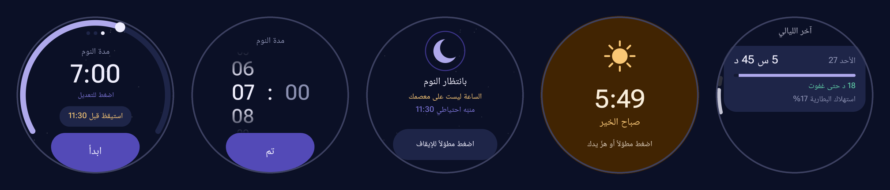
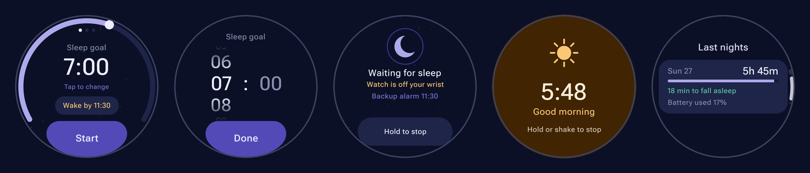

<div align="center">

<picture>
  <source media="(prefers-color-scheme: dark)" srcset="brand/story-dark.svg">
  
</picture>

# دريم بولس — DreamPulse

**المنبّه الذي يبدأ العدّ حين تغفو، لا حين تستلقي.**<br>
منبّه نوم ذكي لساعات Wear OS: ينتظر حتى تنام فعلًا، ثم يعدّ المدة التي طلبتها — وبياناتك لا تغادر ساعتك.

[](CHANGELOG.md)


[](https://github.com/SaadHASSON1/DreamPulse/actions/workflows/ci.yml)

[**⌚ انضم إلى التجربة**](#التثبيت) ·
[الموقع](https://saadhasson1.github.io/DreamPulse/) ·
[سجل الإصدارات](CHANGELOG.md) ·
[سياسة الخصوصية](https://saadhasson1.github.io/DreamPulse/privacy-policy.html) ·
[English](#english)



</div>

---

## ما هو دريم بولس؟

أنام بعد صلاة الفجر، ولا أغفو بمجرد أن أضع رأسي على الوسادة: عشر دقائق في ليلة، وأربعون في أخرى. والمنبّه العادي يقتطع تلك الدقائق من نومي.

**دريم بلس يراقب نبض القلب والحركة، ولا يبدأ العدّ إلا حين تنام فعلًا.** طلبت سبع ساعات؟ تنام سبع ساعات حقيقية.

| | |
|---|---|
| 🌙 **العدّ من لحظة النوم** | يُضبط المنبّه من اللحظة التي تغفو فيها، لا من لحظة الضغط على «ابدأ». |
| 🛟 **منبّه احتياطي من الثانية الأولى** | يُجدوَل فور البدء (المدة + ساعة)، فتستيقظ حتى لو لم يُكتشف النوم أو أُعيد تشغيل الساعة. |
| ⏰ **موعد استيقاظ إلزامي** | حدّ اختياري مثل «ليس بعد السابعة»، مهما تأخّر نومك. |
| 🧠 **استيقاظ ذكي** | في الربع ساعة الأخيرة، إن تقلّبت فعلًا (حركتان منفصلتان) يرنّ المنبّه وأنت في نوم خفيف. رعشة واحدة لا تكفي. |
| ☀️ **منبّه شروق** | تدفأ الشاشة من الليل إلى الفجر؛ اضغط مطوّلًا أو هزّ يدك للإيقاف. |
| 📊 **ملخّص الصباح والسجل** | كم نمت، وكم استغرقت حتى غفوت (لا يُحسب من هدفك)، وكم دقيقة استيقظت مبكرًا، واستهلاك البطارية. آخر سبع ليالٍ. |
| 🌍 **ثلاث لغات** | العربية بواجهة كاملة من اليمين إلى اليسار، والإنجليزية، والتركية، مع اختيار اللغة من داخل التطبيق. |

## خصوصيتك أولًا

- **لا إذن إنترنت أصلًا.** التطبيق لا يستطيع إرسال أي شيء، ولا يصلنا شيء من بياناتك.
- نبض القلب والحركة وسجل النوم **تبقى على ساعتك فقط**.
- **لا حساب ولا تسجيل ولا إعلانات.**

التفاصيل الكاملة: [سياسة الخصوصية](https://saadhasson1.github.io/DreamPulse/privacy-policy.html).

## كيف يُكتشف النوم؟

المنطق كله في [`SleepDetector`](app/src/main/java/com/x13labs/dreampulse/domain/SleepDetector.kt)، صنف Kotlin خالص تغطيه اختبارات، منها اختبارات مبنية على ليلة حقيقية مسجّلة.

1. **خط الأساس:** أول قراءة نبض بعد الضغط على «ابدأ».
2. **تُعدّ نائمًا إذا:**
   - سكنتَ عشر دقائق ونبضك أقل من خط الأساس بـ 15% على الأقل، أو
   - سكنتَ ربع ساعة ونبضك أقل بـ 5% على الأقل، أو
   - أشارت الساعة نفسها إلى النوم (Health Services) وأكّده سكون خمس دقائق، أو
   - سكنتَ سكونًا تامًّا 25 دقيقة، حين لا يتوفر النبض.
3. **فقط والساعة على معصمك:** إن خلعتها يتوقف الاكتشاف، ويبدأ من جديد حين تلبسها.
4. **وقت الغفوة:** منتصف المسافة بين آخر حركة وأول قراءة نبض منخفضة. في أول ليلة مسجّلة أعطى 04:54، الدقيقة نفسها التي سجّلها Samsung Health.

## التثبيت

دريم بولس الآن في **تجربة مغلقة** على Google Play، والانضمام مجاني:

1. انضم إلى مجموعة المجرّبين: [**groups.google.com/g/dreampulse**](https://groups.google.com/g/dreampulse) بحساب Google نفسه الذي على ساعتك.
2. افتح [**رابط التجربة**](https://play.google.com/apps/testing/com.x13labs.dreampulse) واضغط «أصبح مختبِرًا».
3. ثبّت دريم بلس من متجر Play على الساعة، وافتحه، واتبع شاشات الترحيب لمنح الأذونات.

**المتطلبات:** ساعة Wear OS 3 أو أحدث فيها حسّاس نبض. جُرّب على Galaxy Watch7 (Wear OS 6).

> ملاحظاتك تصنع الفرق: راسلنا على [contact@x13labs.com](mailto:contact@x13labs.com).

## ما في هذا المستودع

شيفرة التطبيق كاملة، و**موقع دريم بولس** (GitHub Pages).

```
app/src/main/java/com/x13labs/dreampulse/
├── domain/         SleepDetector و SmartWakeGate (منطق خالص تغطيه الاختبارات)
├── service/        خدمة مراقبة النوم، وخدمة رنين المنبّه
├── receiver/       المنبّهات، وإبقاء الجلسة حيّة، والعودة بعد إعادة التشغيل
├── data/           الإعدادات، وسجل الليالي، و Health Services
├── tile/           البطاقة بجانب واجهة الساعة
└── ui/             الشاشات: الترحيب، الإعداد، المتابعة، المنبّه، الملخّص، السجل، الإعدادات
index.html          الصفحة الرئيسية وقصة الهلال الذي يصير شمسًا
web/                أنماط الموقع وحركته (GSAP + MorphSVG)
brand/              الحركة المستقلة لهذا الملف
tools/story_svg.py  يولّد brand/story-*.svg
```

**البناء:** JDK 17 و Android SDK، والـ Gradle wrapper مرفق.

```bash
./gradlew testDebugUnitTest     # الاختبارات
./gradlew assembleDebug         # نسخة تجريبية
./gradlew bundleRelease         # حزمة المتجر (تحتاج مفتاح الرفع)
```

---

<div id="english" dir="ltr">

## English

**DreamPulse** is a smart sleep alarm for **Wear OS**. It watches heart rate and motion and starts the countdown only once you are actually asleep: ask for 7 hours, get 7 hours. A backup alarm is armed from the first second, an optional wake-by time caps the night, Smart Wake rings early on a real turn-over in the last 15 minutes, and a sunrise screen wakes you gently. Morning summary and 7-night history; English, Arabic (full right-to-left) and Turkish.

It has **no internet permission**: heart rate, motion and sleep history never leave the watch.

**Join the closed test:** join [the testers group](https://groups.google.com/g/dreampulse), then open [the testing link](https://play.google.com/apps/testing/com.x13labs.dreampulse) and install from Google Play on your watch.

[Website](https://saadhasson1.github.io/DreamPulse/) · [Privacy Policy](https://saadhasson1.github.io/DreamPulse/privacy-policy.html) · [Changelog](CHANGELOG.md) · Contact: contact@x13labs.com



</div>

<div align="center"><sub>© 2026 دريم بلس — DreamPulse · X13LABS. جميع الحقوق محفوظة.</sub></div>
